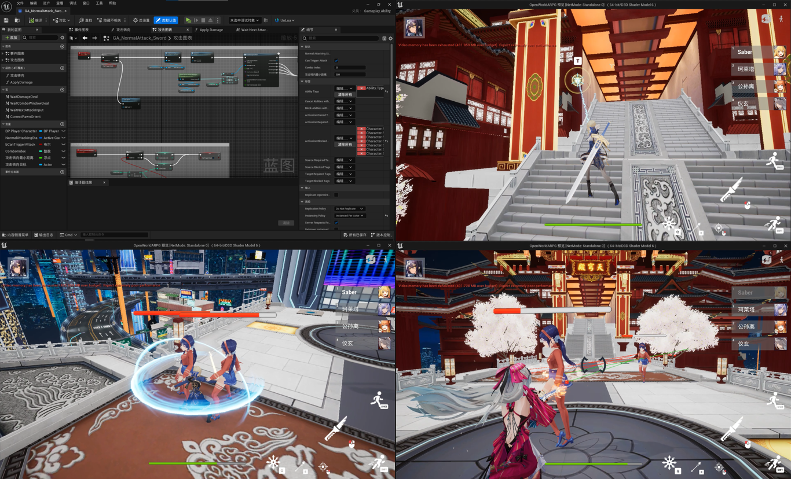
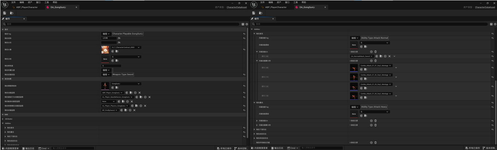
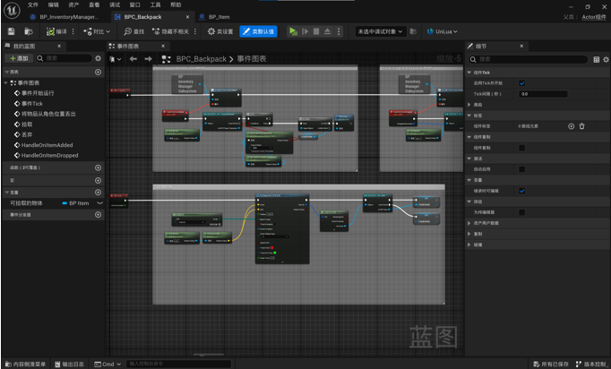
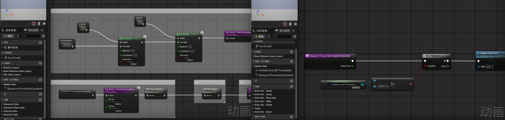
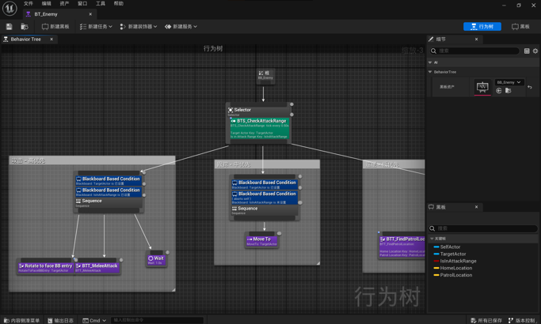
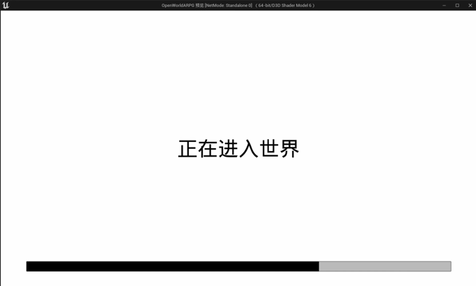

# Open World ARPG

 

## 概述

基于 UE5.2 C++ 与蓝图混合开发的开放世界 ARPG 原型，参考原神式的多角色配队战斗与开放世界探索玩法。项目以 GAS 为核心驱动框架，实现了自定义移动组件（攀爬/滑翔/墙角过渡）、多角色零延迟切换、数据驱动的背包装备系统等功能模块。（仅提供 Content 目录结构，无第三方资源）

## 演示

[Video01](assets/Video01.mp4)

[Video02](assets/Video02.mp4)

[Video03](assets/Video03.mp4)

[Video04](assets/Video04.mp4)

## 技术亮点

### 1. 基于 GAS 的能力驱动架构

使用 Gameplay Ability System 统一驱动所有角色行为与战斗技能，通过 GameplayTag 管理状态与事件，确保逻辑模块化与状态管理的严谨性：

- **探索行为**：跳跃（GA_JumpBase）、冲刺（GA_SprintBase）、慢走（GA_WalkBase）、攀爬（GA_ClimbBase）、滑翔（GA_GlideBase）、钩索（GA_GrappleHookBase）、瞄准（GA_AimBase）均封装为独立 GA，通过 Tag 互斥与事件监听实现状态流转。
- **战斗技能**：近战连招（GA_MeleeAttackBase）、射击（GA_FireBase）、下落攻击（GA_PlungeAttackBase），其中近战连招通过 GameplayEvent Tag（伤害判定窗口、连招窗口开闭、下一次输入）驱动 Combo 逻辑，将动画时序与逻辑判定解耦。
- **角色切换**：GA_SwapOut / GA_SwapIn 实现退场→出场流水线，退场完成后通过委托通知 Controller 执行 Possess，避免 GA 直接引用 Controller 的循环依赖。
- **自定义 AbilityActorInfo**：重写 `UAbilitySystemGlobals::AllocAbilityActorInfo`，在 `FARPGGameplayAbilityActorInfo` 中缓存 CustomMovementComponent 指针，使 GA 可 O(1) 访问 CMC，替代高频的 `FindComponentByClass` 查找。

### 2. 自定义角色移动组件（CMC）

继承 `UCharacterMovementComponent`，通过 `PhysCustom` 实现多种自定义移动模式的物理模拟。采用"CMC 管物理，ActorComponent 管检测"的职责分离设计：

- **攀爬（PhysClimbing）**：自定义重力、贴墙距离保持、沿墙面移动与旋转插值。
- **墙角过渡（PhysCornerTransition）**：区分阳角（凸角）与阴角（凹角），通过 Sweep 检测触发，使用位置/旋转插值实现平滑过渡。
- **翻越（PhysClimbUp）**：从墙沿翻上地面的位移插值，由 ClimbingComponent 检测条件后触发。
- **滑翔（PhysGliding）**：零重力、高空气控制、自定义升降速度区间与最大水平速度限制。
- **性能优化**：所有外部指针在初始化阶段缓存，PhysCustom 内部禁止 `FindComponentByClass`；攀爬检测使用降频 Timer 而非每帧 Tick。

### 3. 多角色配队与零延迟切换

实现配队角色后台共存机制，所有角色生成后进入 Standby 隐藏状态，由外部激活当前操控角色：

- **数据驱动**：`UCharacterDataAsset`（UPrimaryDataAsset）配置角色静态数据（身份、外观、天赋技能、GE），`FCharacterSaveData` 存储运行时动态数据（等级、突破、命座、天赋等级），二者构成角色的唯一数据源。
- **DataTable 索引**：`FCharacterInfoRow` 作为顶层索引链接到 CharacterDataAsset，`UCharacterManagerSubsystem` 维护 Tag→RowName 映射表，支持延迟构建。
- **GA 驱动切换流水线**：Controller 发起切换请求 → 激活 GA_SwapOut（保存 Transform → 播放退场特效 → 进入 Standby）→ 委托通知 Controller → UnPossess/Possess → 激活 GA_SwapIn（设置 Transform → 播放出场蒙太奇 → 赋予无敌 GE）。
- **网络同步**：角色切换通过 Server RPC 发起，StandbyMode 通过 NetMulticast 同步，RuntimeData 通过 `Replicated` 属性复制。

### 4. 数据驱动的背包与装备系统

基于 `UGameInstanceSubsystem` 实现全局背包管理器，与角色状态解耦、可跨关卡持久化：

- **GUID 驱动实例**：`FItemInstance` 以 FGuid 唯一标识每个物品实例，支持不可堆叠物品（武器/圣遗物）和可堆叠物品（材料/食物）的统一管理。
- **类型化实例数据**：`FWeaponInstanceData`（等级/突破/精炼）和 `FArtifactInstanceData`（套装ID/部位/主词条/副词条含强化次数）作为 `FItemInstance` 的变体子数据，通过 `EItemCategory` 区分。
- **圣遗物套装效果**：`FItemData` 中配置 2 件套/4 件套 GE 路径，支持套装效果判定。
- **网络交互**：`UBackpackComponent` 作为 ActorComponent 挂载于角色，拾取/丢弃通过 Server RPC 同步，丢弃时生成带物理模拟的 `AItemBase`。
- **分类容量与排序筛选**：支持按稀有度/等级/时间/名称排序，按分类和稀有度筛选。

### 5. 分层动画架构与多线程安全更新

- **继承与复用**：`UOpenWorldARPGAnimInstance`（基类，处理通用运动数据）→ `UPlayerAnimInstance`（玩家专属，追加瞄准/锁定/冲刺状态），父子 AnimInstance 实现逻辑分层。
- **动画层接口**：通过 `UCharacterDataAsset` 配置 BaseBehavior/Aim/Physics 三组动画层蓝图，运行时按需切换（`SetupBaseBehaviorAnimLayers` / `SetupAimAnimLayers` / `SetupPhysicsAnimLayers`），实现蒙太奇攻击模式与瞄准攻击模式的独立动画逻辑。
- **多线程动画更新**：`NativeUpdateAnimation` 在主线程快照 ASC Tags 与组件状态，`NativeThreadSafeUpdateAnimation` 在 Worker Thread 只读消费快照数据，避免工作线程访问 UObject 的线程安全问题。

### 6. 武器系统与材质特效

- **继承体系**：`AWeaponBase` → `AGunBase` / `ASwordBase`，基类提供 Timeline 驱动的材质特效接口，子类扩展武器专属逻辑。
- **生成/消散特效**：通过 4 条独立 Timeline（生成遮罩、整体光亮、花纹光亮、消散遮罩）驱动 `UMaterialInstanceDynamic` 参数，配合 Niagara 粒子系统实现武器出场/离场视觉表现。
- **数据/表现分离**：`AGunBase` 提供数据接口（FireRange、MuzzleTransform）和表现接口（PlayShootFX：枪口火焰、音效衰减、摄像机震动），供 GA 消费调用。

### 7. 敌人 AI 与战斗交互

- **行为树 + AI 感知**：`AEnemyController` 使用行为树驱动巡逻/追踪/攻击逻辑，通过 `AIPerceptionComponent` 的 `OnTargetPerceptionUpdated` 回调更新黑板目标。
- **GAS 集成**：敌人持有独立的 ASC 与 AttributeSet（`UAS_Enemy`），攻击伤害通过 GE 施加，死亡通过 GA 处理（取消标签、延迟销毁）。
- **动态血条**：Widget Component 实现头顶血条，监听 AttributeSet 的属性变化委托实时更新，每帧 `OrientToScreen` 保持朝向摄像机。

### 8. 异步资源加载与转场管理

- **两阶段加载**：`UGameAssetManagerSubsystem` 统一调度关卡加载（20% 权重）与队伍角色资源加载（80% 权重），通过 `FStreamableManager` 异步加载，进度按权重合并计算。
- **分帧释放**：加载完成后，StreamableHandle 分帧释放（每帧释放 N 个），避免集中 GC 造成的帧率卡顿。
- **中央资产缓存**：DataTable、DataAsset 等高频访问资产首次延迟加载后缓存，后续直接返回缓存指针。

### 9. UI 栈管理与 Tag 路由

- **栈式 UI 管理**：`UUIManagerSubsystem` 维护 UI 栈（后进先出），自动处理输入模式切换（UIOnly/GameAndUI/GameOnly）。
- **Tag 路由**：`UUIDataAsset` 配置 GameplayTag → WidgetClass 映射，通过 Tag 打开 UI，解耦 UI 调用方与具体 Widget 类的依赖。
- **UnLua 集成**：UI 交互逻辑（登录界面等）使用 UnLua 编写，Lua 侧通过 EventBus 模式实现跨模块事件通信。

## 版本

- Unreal Engine 5.2+
- Visual Studio 2022, MSVC 14.34+

## 资源

Plugins：

- [KawaiiPhysics](https://github.com/pafuhana1213/KawaiiPhysics) — 物理骨骼动画
- [SPCRJointDynamics](https://github.com/SPARK-inc/SPCRJointDynamics) — 布料/头发物理模拟
- [UnLua](https://github.com/Tencent/UnLua) — Lua 脚本绑定
- [cats-blender-plugin](https://github.com/absolute-quantum/cats-blender-plugin) — Blender MMD 模型修整

Models：

- [模之屋 (PlayBox)](https://www.aplaybox.com/)

